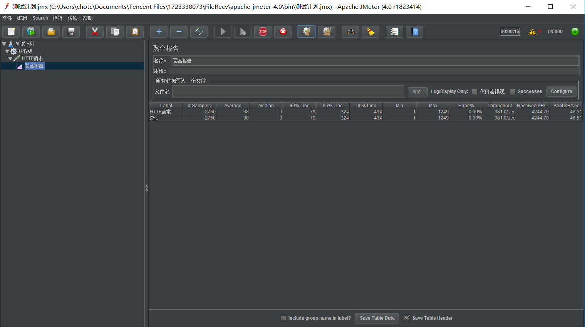
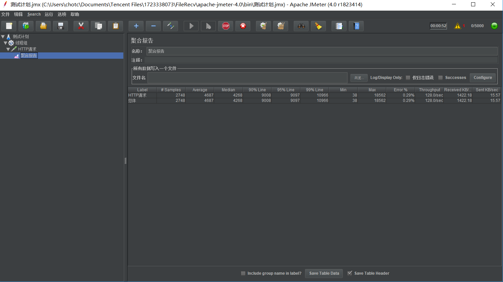

# Part4 Load Balance实验报告

## 测试环境
- ubuntu 16.04（4核，4GB内存）
- JMeter 4.0
- 应用包括前端、后端和MySQL数据库，应用内容是网上书店

## 测试项目
- 节点数：2
- 以replica的数量作为变量，测试其吞吐量、错误率等参数。
- replica数量取[1,2,3,4,5]。
- 线程参数：2000线程

## 测试过程
我们首先测试了一个节点的情况。在一个节点的情况下，吞吐量并没有发生明显变化，并且当大于2000个用户并发访问的时候，我们的应用服务会出现崩溃。故此后的实验我们均以2000次为测试标准。
然后我们新建了节点重复实验，这次可以看出吞吐量的明显变化。1或2个replica时变化不大，但明显replica为3时，吞吐量大大提高，但是replica为4时，吞吐量又降低并出现错误。

## 测试截图

3000次实验，2个replica

3000次实验，3个replica

3000次实验，4个replica

## 数据可视化与分析
### 吞吐量
吞吐量在备份数量为3的情况下性能最为突出，过多或过少的备份数量均降低吞吐量。
### 错误率
备份数为1，2，3时错误率均为0，在备份数量为4时出现错误。

### 总结
备份数量与性能有关，部署于kubernetes负载均衡内的备份数量应该控制在一个合适的范围，过高或过低均会影响性能。
